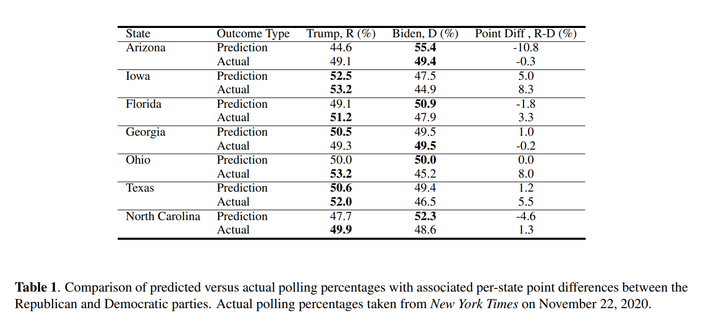

# Our 2020 Election Prediction Results are Here!

In the two weeks prior to the 2020 US Election, we analyzed political trends on Twitter in 7 purported swing states: Arizona, Iowa, Florida, Georgia, Ohio, Texas, and North Carolina. We extracted close to 700,000 political tweets &mdash; each geotagged to one of the seven above-mentioned states &mdash; and used machine learning to assign a political label (Democratic/Republican) to each tweet.

We aggregated the tweets from each state to determine our per-state predictions. The predictions for these states are shown in the map below. The exact D/R counts of each state can be found in results/Prediction2.ipynb:

Due to the Twitter API rate limitations, we can only make predictions for 7 states; for the remaining 43 states (plus D.C.), we use the FiveThirtyEight predictions (https://projects.fivethirtyeight.com/2020-election-forecast/). FiveThirtyEight reports at least 80% confidence in each of the 43 remaining states (plus D.C.). Our full election prediction map is shown below:

# Predicted Winner: Joe Biden (353 D / 185 R)

# Actual Winner: Joe Biden (306 D / 232 R) (According to *New York Times*, as of November 22, 2020)

## For more interested readers, please continue reading!

Our predictions correctly predicted the outcome of 46 / 50 states as well as the District of Columbia. The 4 misclassified states were Florida, Georgia, Ohio, and North Carolina &mdash; all of which were states that our algorithm explicitly predicted. Although only 3/7 states were correctly classified by our Twitter algorithm, we overall believe that there is a strong correlation between the collective political opinion on Twitter and the actual political opinion of Americans. In particular, our algorithm reported a *mean point difference error* of 5.47%, which is fairly accurate considering that we expect about 10% of the Tweets to be misclassified by our Twitter Algorithm (see Table of Results below). The exact break down of per-state polling percentages and point differences is shown in the table below:

We believe that collecting data over a longer timespan than 2 weeks would have resulted in more robust predictions &mdash; not only because we would have had more data, but also because we believe that the final voting decisions of most Americans are determined far before the 2 weeks prior to the election. 

Lastly, it seems that taking the point-wise preditions of the high-confidence (at least 80%) states from FiveThirtyEight worked well, as all 43 states (plus D.C.) were correctly predicted by FiveThirtyEight.

## Data Collection

We collected nearly 700,000 tweets by sampling from the 7 chosen states proportional to the their relative populations. One consequence of this sampling procedure is that more densely populated states will account for a larger proportion of the 700,000 tweets. However, in general, the densely populated states have more electoral college votes, so this sampling procedure ensures that the most *important* swing states have the most *robust* predictions. 

To ensure that the collected tweets pertained to the US election, we queried Twitter to match a set of hashtags and keywords related to the US election. The set of keywords/hashtags can be found in supp/hashtags_keywords.txt.

## Machine Learning

**The prediction task is simple: Given a tweet, is the tweet in support of the Democratic party (D) or the Republican party (R)?**

Before we could perform any machine learning on the collected Twitter data, we first needed a way to heuristically annotate a subset of the data. To achieve this, we created two hashtag lists: hd and hr. Each hashtag list contains a subset of the querying hashtags which clearly indicate support for the Democratic and Republican parties, respectively. We then assign an R label to every tweet which contains a hashtag in hr, but not hd, and similarly assign a D label to every tweet which contains a hashtag in hd, but not hr. This gave us an annotated dataset of ~250,000 tweets. hd and hr can be found in supp/hashtags_keywords.txt.

As ~400,000 tweets are still unlabelled, we design a machine learning model called *TweetPredict* to make these predictions. *TweetPredict* takes the text content of a tweet as input, and outputs a probability distribution over the two political parties (D/R). Using our heuristically annotated dataset, *TweetPredict* learns to classify tweets as either (D)emocratic or (R)epublican in a fully-supervised manner.

To ensure that *TweetPredict* does not simply learn the mapping from hashtag &rarr; political party, we mask all hashtags contained in either hd or hr as a preprocessing step.

### Follower Features

In addition to the tweet content, we also wanted our model to leverage the structure in the Twitter social network to guide its predictions. We thus collected a list of popular Democratic and Republican Twitter accounts and extracted all the followers of these accounts using the Twitter API. Due to rate limitations, we were limited to extracting 30,000,000 followers over all the accounts. We thus chose the following accounts: 
- Democratic: @JoeBiden (11.6M)
- Republican: @Mike_Pence (5.4M), @seanhannity (5.3M), @TuckerCarlson (4.2M), @TeamTrump (2.3M)

We then matched the user accounts of the extracted tweets to the followers of these 5 accounts. In total, 80.7% of the extracted tweets were posted by a user who follows at least one of the above accounts. For each tweet, we create a 2-dimensional binary vector which encodes whether the user who posted the tweet follows a Democratic and/or a Republican account. We revised our *TweetPredict* model to include these Follower Features (FF), which we call *TweetPredict + FF*. The *TweetPredict + FF* model is shown in the Figure below:

### Graph Neural Networks

With the Follower Features, we can now construct a graph *G* which approximates the political structure of Twitter. More concretely, we encode each Tweet as a node in the graph *G* and connect two tweets by an edge if and only if the users who posted the tweets either both follow a Democratic Twitter account or both follow a Republican Twitter account. To avoid the quadratic explosion in the edge-creation procedure, each tweet is connected to 10 tweets sampled uniformly at random from the set of tweets it would be connected to following the above construction.

With this approximated graph structure, we can now utilize recent advancements in Graph Neural Networks to leverage this graphical structure for training. The underlying intuition is that *the political leaning of Tweet i is close to the political learning of the tweets in N(i), where N(i) is the neighbourhood of tweet i in graph G*. To leverage this graphical structure, we use Graph Attention Networks &mdash; a graph neural network architecture proposed in the 2018 ICLR paper *Graph Attention Networks*, by Petar Velickovic et al.

We concatenate the final hidden states of the trained Bi-GRU (both directions) as well as the Follower Features to create the features for our Graph Attention Network. The Graph Attention Network is trained end-to-end in a Transductive setting, as the same graph *G* is used for training and inference. We call our revised *TweetPredict* model with graph neural networks *GNNTweetPredict + FF*, as it incorporates the learned embeddings from the *TweetPredict + FF* model into a GNN framework.

### Machine Learning Results

The table of results for our machine learning models is shown below. We first state a non-machine learning baseline which follows the heuristic to always select the majority class label (D).

Note that the *TweetPredict + FF* model was used for the election prediction as the *GNNTweetPredict + FF* model was trained after the 3rd of November. The GNN model reported the strongest performance. As the data was imbalanced (69.2% Democratic tweets), the *TweetPredict* models reported stronger performance on the Democratic tweets; in the future, we may use a reweighting scheme to balance out the performance of the Democratic and Republican tweets so that the model is not biased towards either political party.

### Thanks for reading to the end!
