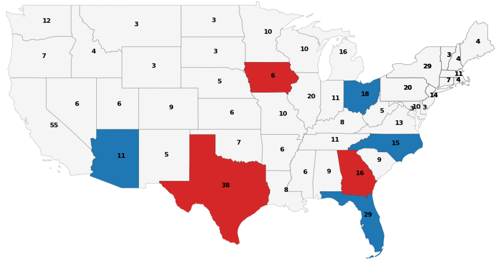
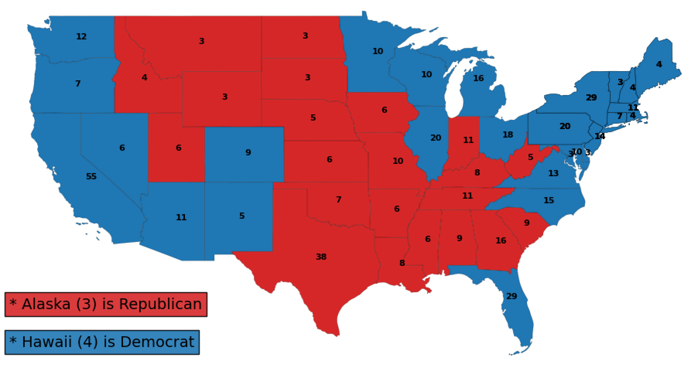
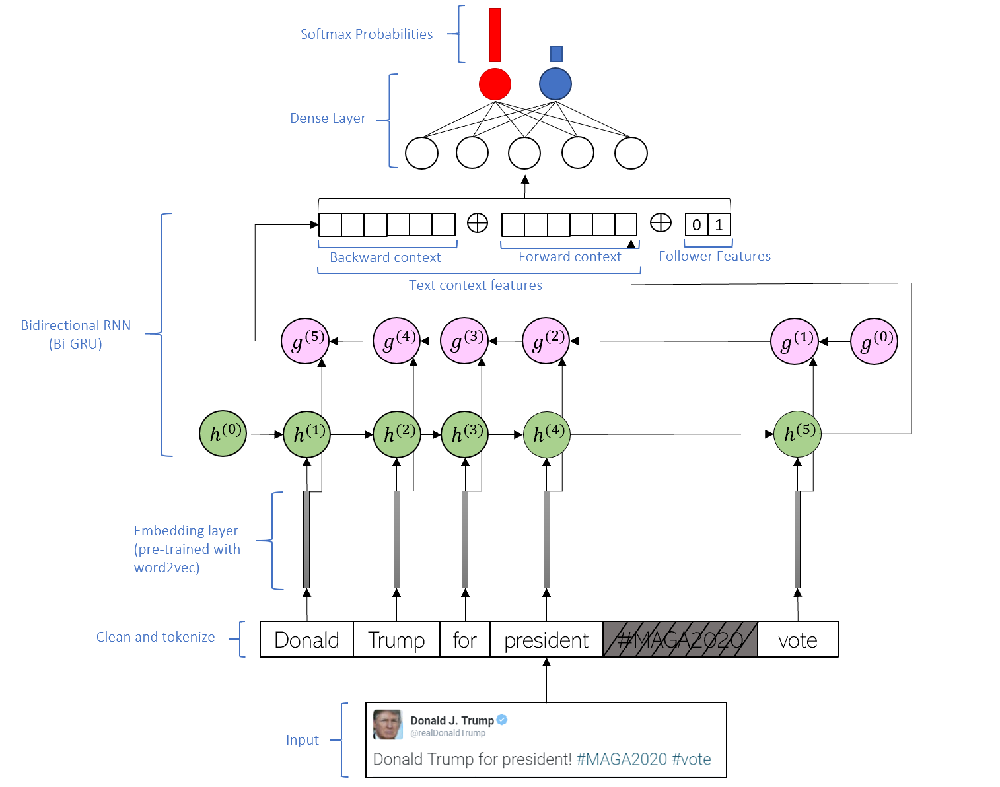
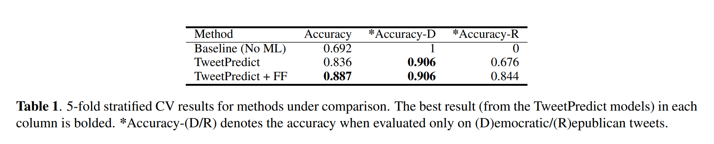

# Our 2020 Election Prediction Results are Here!

Over the last 14 days, we analyzed political trends on Twitter in 7 purported swing states: Arizona, Iowa, Florida, Georgia, Ohio, Texas, and North Carolina. We extracted close to 700,000 political tweets -- each geotagged to one of the seven above-mentioned states -- and used machine learning to assign a political label (Democratic/Republican) to each tweet.

We aggregated the tweets from each state to determine our per-state predictions. The predictions for these states are shown in the map below:

Due to the Twitter API rate limitations, we can only make predictions for 7 states; for the remaining 43 states, we use the FiveThirtyEight predictions (https://projects.fivethirtyeight.com/2020-election-forecast/). FiveThirtyEight reports at least 80% confidence in each of the 43 remaining states. Our full election prediction map is shown below:

# Predicted Winner: Joe Biden (353 D / 185 R)

## For more interested readers, please continue reading!

### Data Collection

We collected nearly 700,000 tweets by sampling from the 7 chosen states proportional to the their relative populations. One consequence of this sampling procedure is that more densely populated states will account for a larger proportion of the 700,000 tweets. However, in general, the densely populated states have more electoral college votes, so this sampling procedure ensures that the most *important* swing states have the most *robust* predictions. 

To ensure that the collected tweets pertained to the US election, we queried Twitter to match a set of hashtags and keywords related to the US election. The set of keywords/hashtags can be found in supp/hashtags_keywords.txt.

### Machine Learning

**The prediction task is simple: Given a tweet, is the tweet in support of the Democratic party (D) or the Republican party (R)?**

Before we could perform any machine learning on the collected Twitter data, we first needed a way to heuristically annotate a subset of the data. To achieve this, we created two hashtag lists: hd and hr. Each hashtag list contains a subset of the querying hashtags which clearly indicate support for the Democratic and Republican parties, respectively. We then assign an R label to every tweet which contains a hashtag in hr, but not hd, and similarly assign a D label to every tweet which contains a hashtag in hd, but not hr. This gave us an annotated dataset of ~250,000 tweets. hd and hr can be found in supp/hashtags_keywords.txt.

As ~400,000 tweets are still unlabelled, we design a machine learning model called *TweetPredict* to make these predictions. *TweetPredict* takes the text content of a tweet as input, and outputs a probability distribution over the two political parties (D/R). Using our heuristically annotated dataset, *TweetPredict* learns to classify tweets as either (D)emocratic or (R)epublican in a fully-supervised manner.

To ensure that *TweetPredict* does not simply learn the mapping from hashtag &rarr; political party, we mask all hashtags contained in either hd or hr as a preprocessing step.

In addition to the tweet content, we also wanted our model to leverage the structure in the Twitter social network to guide its predictions. We thus collected a list of popular Democratic and Republican Twitter accounts and extracted all the followers of these accounts using the Twitter API. Due to rate limitations, we were limited to extracting 30,000,000 followers over all the accounts. We thus chose the following accounts: 
- Democratic: @JoeBiden (11.6M)
- Republican: @Mike_Pence (5.4M), @seanhannity (5.3M), @TuckerCarlson (4.2M), @TeamTrump (2.3M)

We then matched the user accounts of the extracted tweets to the followers of these 5 accounts. In total, 80.7% of the extracted tweets were posted by a user who follows at least one of the above accounts. For each tweet, we create a 2-dimensional binary vector which encodes whether the user who posted the tweet follows a Democratic and/or a Republican account. We revised our *TweetPredict* model to include these Follower Features (FF), which we call *TweetPredict + FF*. The *TweetPredict + FF* model is shown in the Figure below:

The table of results for our machine learning models is shown below. We first state a non-machine learning baseline which follows the heuristic to always select the majority class label (D).

In the near future, we plan to extend our *TweetPredict* model to a Graph Neural Network (GNN) framework so that the Twitter social network can be better leveraged for prediction.

### Thanks for reading to the end!
